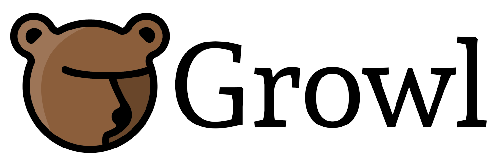
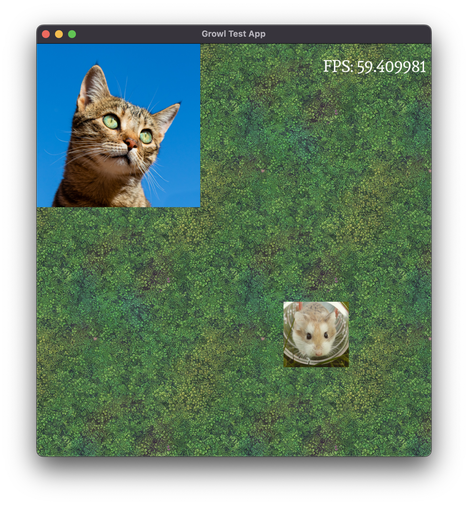

[](https://isocpp.org/)
[](https://en.wikipedia.org/wiki/C%2B%2B17)

Growl is a lightweight, portable game development framework written in C++17.
It is intended to help you make 2D video games for a variety of different
platforms, without being too opinionated about how your code is structured.

## Platforms

Out of the box, Growl has support for the following platforms:

- Windows
- macOS
- Linux
- Android (4.4+)
- iOS (13.0+)
- Web

Growl's plugin-based architecture should make it easy to port to any platform
that modern C++ can be built against. So far, it has been ported to the
following platforms:

- Nintendo 3DS (Homebrew)

## Prerequisites

To build with Growl, you will need the following:

- A modern C++ compiler. Growl has been built with Clang, GCC, MSVC and
Emscripten.
- CMake (3.20+)

Growl assumes familiarity with modern C++ features like smart pointers and  move
semantics, but it doesn't use anything particularly arcane. Familiarity with
CMake is also assumed. Growl has been tested with the Unix Makefile, Xcode and
Visual Studio generators, but others should work just fine.

## Dependencies

Growl uses vendored dependencies, so you shouldn't need any libraries other
than the ones necessary for your specific platform (e.g. Android NDK,
Emscripten). The exception to this is [SDL2](
https://www.libsdl.org/
), which you'll need to provide yourself if building on a desktop platform.

## Getting started

The first thing to do is build the included test app, so you can check
everything is working on your system. This guide assumes you're using a command
line, but you can use the CMake GUI if you like.

1. Clone the repository to your local system. Ensure you clone recursively so
that submodules (for third-party dependencies) get pulled too.
```bash
git clone --recursive git@github.com:Bearwaves/growl.git
```

1. From the root of the repository, navigate to `example/testapp`, and create
a `build` directory.

1. From your newly created `build` directory, run `cmake ..`. This is known as
an out-of-tree build.  
If CMake isn't able to find SDL2 on your system, it will shout at you. You
can use the `SDL2_INCLUDE_DIR` and `SDL2_LIBRARY` flags to tell CMake where it
is.

1. Once CMake has generated all the necessary files, run the `make` command to
compile everything. You may want to pass the `-j` flag to enable multithreading,
e.g. `make -j 4` to build with four threads.

1. Two executables will be built: `growl-test-app` and `growl-cmd`. Use
`growl-cmd` to generate the asset bundle, like so:
```bash
./growl-cmd assets bundle ../../assets/
```

1. Run the app!
```bash
./growl-test-app
```


The test app demonstrates asset loading, rendering, audio, input, text
rendering and the debug menu (try pressing F12).

## Next steps 

Once you've got the test app running, you're ready to start building your game
in Growl. Here are some topics you might want to read about next.

- [Overview](https://growl.bearwaves.com/#/overview) - read about Growl's high level architecture, concepts
and design approach.
- [Building](https://growl.bearwaves.com/#/building) - learn how to build Growl for a variety of systems,
such as iOS or web.
- [Using Growl](https://growl.bearwaves.com/#/using) - learn about the various features and components
available to build your game.
- [Extending](https://growl.bearwaves.com/#/extending) - learn how to build plugins for Growl to add
functionality or port it to a new platform.
