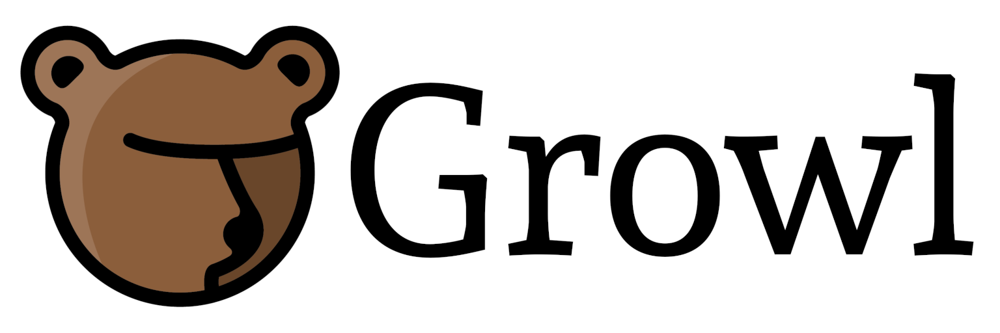

Growl is a lightweight, portable game development framework written in C++17.
It is intended to help you make 2D video games for a variety of different
platforms, without being too opinionated about how your code is structured.

It's the engine we used to make [Dave's Word Game](https://www.playdwg.com), which is out now.

## Learn more

Read the [docs](https://growl.bearwaves.com/#/?id=growl).
