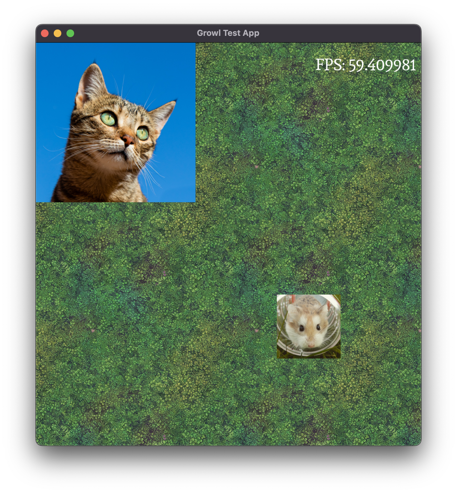

# Growl

Growl is a lightweight, portable game development framework written in C++17.
It is intended to help you make 2D video games for a variety of different
platforms, without being too opinionated about how your code is structured.

## Platforms

Out of the box, Growl has support for the following platforms:

- Windows
- macOS
- Linux
- Android (4.4+)
- iOS (13.0+)
- Web

Growl's plugin-based architecture should make it easy to port to any platform
that modern C++ can be built against. So far, it has been ported to the
following platforms:

- Nintendo 3DS (Homebrew)

## Prerequisites

To build with Growl, you will need the following:

- A modern C++ compiler.
  - Growl has been built with Clang, GCC, MSVC and
Emscripten.
- CMake (3.20+)
  -   On macOS or Linux run `brew install cmake` to install [cmake](https://formulae.brew.sh/formula/cmake).
  -   On Windows use this [installer](https://cmake.org/download/).
- A utility for directing code compilation.
  -   On macOS and Linux we recommend [make](https://formulae.brew.sh/formula/make) (4.4.1+). Run `brew install make` to install it.
  -   On Windows we recommend installing [Visual Studio](https://visualstudio.microsoft.com/downloads/). Be sure to select the **Desktop development with C++** workload duing the installation process, this includes everything that you'll need.

Growl assumes familiarity with modern C++ features like smart pointers and  move
semantics, but it doesn't use anything particularly arcane. Familiarity with
CMake is also assumed. Growl has been tested with the Unix Makefile, Xcode and
Visual Studio generators, but others should work just fine.

## Dependencies

Growl mostly uses vendored dependencies, so you shouldn't need any libraries other
than the ones necessary for your specific platform (e.g. Android NDK,
Emscripten).

## Getting started

The first thing to do is build the included test app, so you can check
everything is working on your system. This guide assumes you're using a command
line, but you can use the CMake GUI if you like.

### macOS & Linux guide
1. Clone the repository to your local system. Ensure you clone recursively so
that submodules (for third-party dependencies) get pulled too. `git clone --recursive git@github.com:Bearwaves/growl.git`
1. From the root of the repository, navigate to `example/test_app`, and create a `build` directory.
1. From your newly created `build` directory, run `cmake ..`. 
1. Once CMake has generated all the necessary files you'll need to compile eveything. To do that run `make`. You may want to pass the `-j` flag to enable multithreading, e.g. `make -j 4` to build with four threads. 
1. Two executables will be built: `growl-test-app` and `growl-cmd`. Still in the `build` directory, use
`growl-cmd` to generate the asset bundle, like so: `./growl-cmd assets bundle ../../assets/`
1. Still in the `build` directory, run `./growl-test-app`.

### Windows guide
1. Clone the repository to your local system. Ensure you clone recursively so
that submodules (for third-party dependencies) get pulled too. `git clone --recursive git@github.com:Bearwaves/growl.git`
1. From the root of the repository, navigate to `example/test_app`, and create a `build` directory.
1. From your newly created `build` directory, run `cmake ..`. 
1. Once CMake has generated all the necessary files you'll need to compile eveything. To do that, 
locate the `growl-test-app.sln` that CMake just generated in your `build` folder. Open it in Visual Studio and hit **F6** on your keyboard to build the solution. Once the build succeeds, you can close Visual Studio.
1. Two executables will be built: `growl-test-app` and `growl-cmd`. Still in the `build` directory, use
`growl-cmd` to generate the asset bundle, like so: `Debug\growl-cmd.exe assets bundle ../../assets/`
1. Still in the `build` directory, run `growl-test-app` like so: `Debug\growl-test-app.exe`.

The test app demonstrates asset loading, rendering, audio, input, text
rendering and the debug menu (try pressing **F12**).

## Next steps 

Once you've got the test app running, you're ready to start building your game
in Growl. Here are some topics you might want to read about next.

- [Overview](/overview) - read about Growl's high level architecture, concepts
and design approach.
- [Building](/building) - learn how to build Growl for a variety of systems,
such as iOS or web.
- [Using Growl](/using) - learn about the various features and components
available to build your game.
- [Extending](/extending) - learn how to build plugins for Growl to add
functionality or port it to a new platform.
